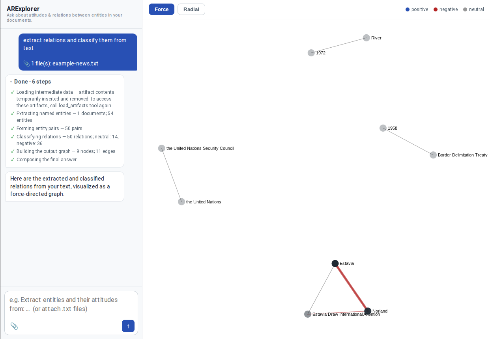

# ARExplorer


[](https://github.com/nicolay-r/bulk-ner)
[](https://github.com/nicolay-r/bulk-chain)

<p align="center">
  
</p>

An ADK 2.0 agent for extracting **Attitudes and Relations** from documents,
exposing three tools: named-entity recognition (bulk-ner), relation/attitude
classification (bulk-chain), and graph set operations (union / intersection).

ARExplorer is the successor to **[ARElight](https://github.com/nicolay-r/ARElight)**,
the early [AREkit](https://github.com/nicolay-r/AREkit) demo (ECIR 2024) for
granular attitude/relation visualization in large documents. The current stack: ADK agent, bulk-ner/bulk-chain tooling, and a chat-driven UI with D3JS for graph visulization.

<p align="center">
    
</p>

Two-panel web UI — left panel chats with the agent, main panel renders the
returned attitude graph with d3.js (force / radial layouts). The agent replies
with a structured `AgentResponse` (`src/schema.py`); the chat shows `message`
and the graph drives the visualization.

## Installation

Requires **Python 3.10**. From the repository root:

**1. Create a virtual environment and install dependencies**

```bash
python3.10 -m venv .venv
source .venv/bin/activate
pip3.10 install -r requirements.txt
```

**2. Install demo provider dependencies**

The NER and relation tools load adapters from
[`.recepie/arexplorer-demo/providers/`](.recepie/arexplorer-demo/providers/)
(spaCy NER + Replicate LLM). Install their extra packages and download the
spaCy model:

```bash
pip3.10 install -r .recepie/arexplorer-demo/providers/requirements.txt
python3.10 -m spacy download en_core_web_sm
```

**3. Create `.env` with API keys and provider paths**

Copy or create a `.env` file in the project root (loaded automatically by
`src/server.py`):

```bash
cat > .env <<'EOF'
GOOGLE_API_KEY=<your-google-api-key>
REPLICATE_API_TOKEN=<your-replicate-api-token>

RELATION_MODEL=meta/meta-llama-3-70b-instruct
RELATION_PROVIDER_FILEPATH=.recepie/arexplorer-demo/providers/replicate_104.py

NER_SRC_DIR=.recepie/arexplorer-demo/providers
NER_CLASS_FILEPATH=spacy_383.py
NER_CLASS_NAME=SpacyNER
NER_MODEL=en_core_web_sm
EOF
```

Replace the placeholder keys before running the server.

## Starting Server

```bash
uvicorn src.server:app --port 8000
```

Then open http://127.0.0.1:8000/.

## Deployment

Using docker-compose:

```bash
cd .recepie/arexplorer-demo
docker compose up --build
```

Then open http://127.0.0.1:2000/ (Compose maps host port `2000` → container
`8000`). Stop and remove the container with:

```bash
docker compose down
```

## Dependencies

ARExplorer builds on two local projects:

- **[bulk-ner](https://github.com/nicolay-r/bulk-ner)** — batch NER over large text collections Powers `extract_named_entities`.
- **[bulk-chain](https://github.com/nicolay-r/bulk-chain)** — batched LLM prompting with Chain-of-Thought schemas. Powers `classify_relations`.
